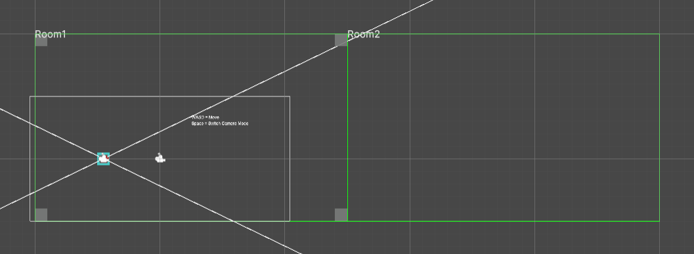

# Cinemachine Room2D Extension

矩形領域内にカメラの移動を制限する為の 2D / 2.5D カメラ用 Cinemachine Extension.  

2D (Orthographic) だけなら標準の CinemachineConfiner で可能だけど 3D 版が無いので作成。  
領域を Collider ではなく Rect で制限しているので複雑な形状には対応していない。

## Demo (WebGL)

https://tukanpo.github.io/CinemachineRoom2DExtension/

上にある画像の緑の枠が設定済の制限領域。（Room と呼ぶ）  
WASD（又はカーソルキー）で移動したりはみ出したりして確認可能。  
Space キーで投影方式の切替え。 

## Class

`Assets/App/Scripts/Cameras` ディレクトリ以下が必須ファイル

#### Room2D
矩形領域を表現する為のコンポーネント  
内部で Rect を保持しているだけ

#### Room2DEditor
SceneView 上での編集を楽にする為のエディタ拡張  

#### CinemachineRoom2D
Room2D 内カメラ移動制限 Cinemachine Extension

## 利用方法
- GameObject に Room2D コンポーネントをアタッチしてサイズ調整する。
- CinemachineVirtualCamera は `Framing Transposer` にして Follow ターゲットを設定。
- Extension に CinemachineRoom2D を追加して Room2D のゲームオブジェクトを指定する。  

## DemoScene について追記

Space キーでの投影方式切替時に `もう一方の投影方式の見た目を合わせる為のカメラ設定` が UnityEditor 上でログ出力される。

Perspective なら `OrthographicSize`、Orthographic なら `FOV` を出力。  
詳細は DemoScene コンポーネント内のコードを参照。  

## 参考
カメラからの距離で求める錐台のサイズ  
https://docs.unity3d.com/ja/2022.3/Manual/FrustumSizeAtDistance.html
